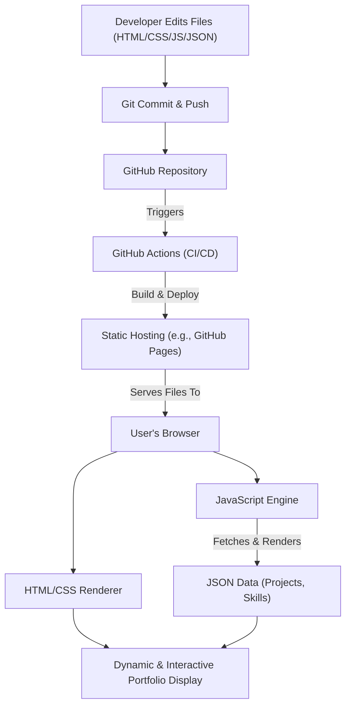

# 🚀 Dynamic Portfolio Website

<p align="center"></p>

## Short Description
Unleash your professional narrative with this sleek, responsive, and dynamic portfolio website! Designed for developers, designers, and creatives, this project provides a robust foundation to showcase your skills, experience, and projects in an engaging and interactive manner. Built with a modern tech stack and featuring automated deployment, it's the perfect platform to make a lasting impression.

## ✨ Key Features
*   **Dynamic Content Management:** Easily update projects and skills via simple JSON files, keeping your portfolio fresh without diving into code.
*   **Automated CI/CD Pipeline:** Leveraging GitHub Actions, your changes are automatically built and deployed, ensuring a seamless and efficient workflow.
*   **Elegant & Responsive Design:** Crafted with modern HTML5 and CSS3, guaranteeing a flawless viewing experience across all devices.
*   **Interactive User Experience:** Engaging JavaScript enhancements, including dynamic effects and responsive elements, capture visitor attention.
*   **Dedicated Sections:** Clearly structured pages for showcasing experience, projects, and providing contact information.
*   **Custom 404 Page:** A branded, user-friendly error page to maintain a professional brand even when things go awry.
*   **Integrated Resume Download:** Provide a direct link for visitors to download your resume with ease.

## Who is this for?
This project is ideal for:
*   **Software Developers:** Showcase your coding prowess, projects, and technical journey.
*   **Web Designers:** Present your UI/UX designs and front-end expertise.
*   **Freelancers & Consultants:** Establish a strong online presence to attract new clients.
*   **Job Seekers:** Create an impressive digital resume that stands out to recruiters and hiring managers.
*   **Students:** Build your first professional online portfolio to share your academic and personal projects.

## Technology Stack & Architecture
This portfolio website harnesses the power of foundational web technologies for speed and reliability, enhanced by modern development practices:

*   **HTML5:** The core structure of all web pages.
*   **CSS3:** Styling and visual presentation, including responsive design.
*   **JavaScript:** Powering dynamic content loading, interactive elements, and custom behaviors.
*   **JSON:** Used for structuring and easily updating project and skill data.
*   **GitHub Actions:** For an automated Continuous Integration/Continuous Deployment (CI/CD) pipeline.

## 📊 Architecture & Database Schema
Given this is a static, client-side rendered portfolio website, there is no traditional database schema. The architecture focuses on content delivery and dynamic presentation via client-side logic.



## ⚡ Quick Start Guide
Getting this portfolio website up and running is straightforward:

1.  **Clone the repository:**
    ```bash
    git clone https://github.com/samruddhidchavan2915-bit/portfolio_website.git
    cd portfolio_website
    ```
2.  **Open Locally:**
    Simply open the `index.html` file in your web browser to view the portfolio.
3.  **Customize Content:**
    *   Edit `projects/projects.json` to add or modify your projects.
    *   Edit `skills.json` to update your technical skills.
    *   Modify `assests/resume.pdf` with your own resume.
    *   Adjust HTML, CSS, and JavaScript files as needed for deeper customization.
4.  **Deploy (Optional):**
    This project is ready for static site deployment. Push your changes to GitHub, and the integrated GitHub Actions CI/CD will automatically deploy your updated portfolio to your chosen static hosting provider (e.g., GitHub Pages).

## 📜 License
This project is licensed under the MIT License. See the `LICENSE` file for more details.